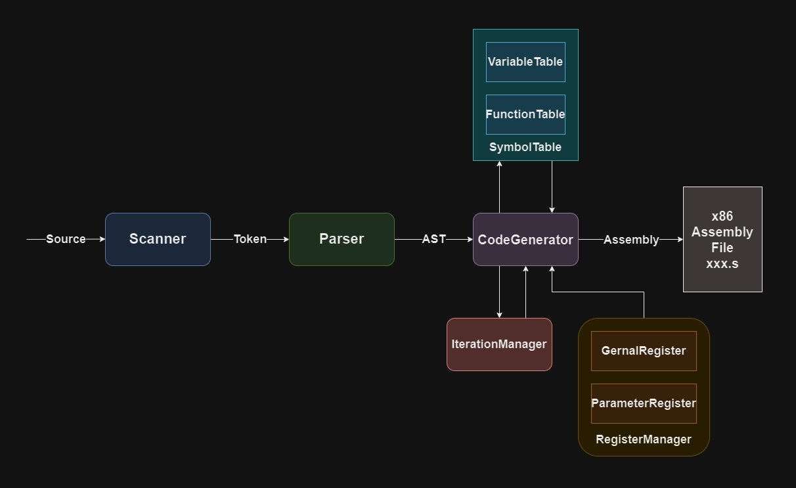

# PJDCc

# A compiler of PJDC 

# (C Programming Language ' s Subset)

## Framework



## Install

After you clone this reposity, you just need to run my shell script : )

```shell
bash install.sh
```

**Note:**

PJDCC can compile code to x86 assembly. I borrow nasm to assembly, gcc's ld to link. So I will install nasm and gcc for you at first.

### I have write some examples in "example" directory

### You can try to use pjdcc compile them after install successfully

## Uninstall

Just like install, I have write a shell script for you :

```shell
bash uninstall.sh
```

## Usage

PJDCC's usage is very easy.

```shell
pjdcc [-ESTA] input_file
```

**-E**: Generate executable file (default)

**-S**: Compile to assembly file

**-T**: Scan the code, print tokens

**-A**: Parse the code, print abstract syntax tree

**Note:**

You don't need to input out_file's name.

If you pjdcc [-E] xxx.c, I will generate the executable file named xxx.

If you pjdcc -S xxx.c, I will generate the x86 assembly file named xxx.s.

## Support

### The whole ebnf grammar is in PJDC.ebnf

### Data Type

* Basic Type: char(1byte), int(4byte), long(8byte), void(Function can return)
* Pointer Type: One dimension pointer of Basic Type, char*, int*, long*
* Array: One dimension array of Basic Type, char[], int[], long[]

### Function

* Type: return Basic Type and Pointer Type
* Parameter: Basic Type and Pointer Type
* **Support recursion function call**
  
### Scope

* Basic Type and Pointer Type support global variable and local variable
* Array only support global array
* Support initialize, global array can use initialized list

### Statement

* Selection Statement: if and if-else, if else-if else-if...
* Iteration Statement: while, do-while, for
* Continue and Break
* Function Return

### Expression (Operator)

* Comma Expression: xxx,xxx,xxx
* Assignment: identifier=xxx; *identifier=xxx; identifier[xxx]=xxx;
* Ternary: xxx ? xxx : xxx
* Logical Or And Not: || && !
* Bit Or Xor And Not: | ^ & ~
* Relational: == != < <= > >=
* Shift: << >>
* Arithmetic: + - * / %
* Increment Decrement: ++ --
* Sizeof: sizeof(Type) sizeof(identifier)

### Comment

* Single-line: //xxx
* Multi-line: /* xxx */
  
## Kiss declaration ( ^ 3 ^ )

Because I don't implement preprocessor and library, so I create this Keyword--**kiss** : )

If you use printf and scanf, I will help you link with standard library automaticly

But If you want to use other library's function, you need to **"kiss" declare it**

### PS: How romantic it is !!! ( > _ < )

### Example

```c
kiss strlen;

int main()
{
    char* s="Baby,Kiss me!";

    printf("len=%d\n",strlen(s));

    return 0;
}

```

## Limit

### If you want to use pjdcc to compile your own code

### I strongly recommend you to read the limit.md at first

### Avoid you are confused by pjdcc's compile error ( > _ < )
